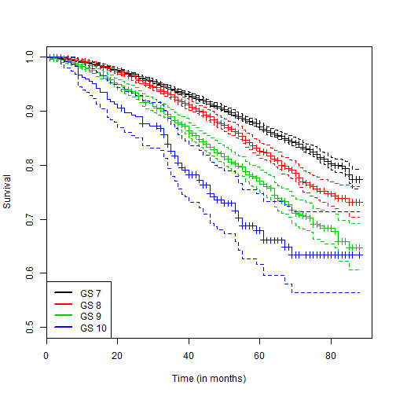

# Example Data Analysis Report Reproducible Research Using knitr with markdown


## Introduction

This document serves as an example data analysis report generated using R for
the analysis, markdown for the markup report writing language, and knitr to bring
everything together.   The data set used is a fictitious as was generated for
example purposes only.  The purpose of this document is to provide an example of
reproducible research.

**Disclaimer** I'm not an expert at markdown.  There _are_ better ways to do
this.  I prefer working in LaTeX and have not done much with Markdown.  In
general, there does seem to be a growing community of markdown users.  Please
feel free to fork the repo and improve upon this example.

*Reproducing this report*  These are the steps required for
reproducing this report.

1. Install R on your computer.

2. Suggested installs: pandoc and/or a markdown viewer for your web browser

3. Open R, install the knitr package if the package is not on your system.


```r
install.packages("knitr", repos = "http://cran.rstudio.com")
```


4. Set the working directory in R to the same directory as this file exists in.
Run the following commands in R, 


```r
library(knitr)
knit(input = "basicsMarkdown.Rmd")
```


5. The above R code will generate the file basicsMarkdown.md.  Use pandoc <a>  http://johnmacfarlane.net/pandoc/ </a> to
   convert the markdown into other file formats, inlcuding LaTeX, html, .docx,

```r
pandoc(input = "basicsMarkdown.md", format = "docx")  # transform the .md to .docx
```


## Analysis Methods

Overall survival analysis was done using both
Kaplan-Meier estimates and Cox proportional hazard regression models.  
The analysis was done in R version 3.0.1 (2013-05-16) and the
survival analysis was done using the survival package.
Statistical significance was set at the 0.05 level.

## Analysis and Results 


The data set consisted of 19,039
records.  A summary of the data set is presented
in the table below.  Reported values are counts and percentages... (I need to
learn more about markdown tables to make this pretty.)

|id               |overall  |overall  |GS 7   |GS 7   |GS 8   |GS 8   |GS 9   |GS 9   |GS 10  |GS 10  |
|:----------------|:--------|:--------|:------|:------|:------|:------|:------|:------|:------|:------|
|                 |n        |%        |n      |%      |n      |%      |n      |%      |n      |%      |
|[40,50)          |3,051    |16.03    |2,145  |16.52  |544    |14.82  |323    |15.10  |39     |15.98  |
|[50,70)          |5,945    |31.23    |4,259  |32.80  |1,005  |27.38  |608    |28.42  |73     |29.92  |
|[70,85]          |10,043   |52.75    |6,582  |50.69  |2,121  |57.79  |1,208  |56.47  |132    |54.10  |
|Era 1            |8,615    |45.25    |5,869  |45.19  |1,659  |45.20  |970    |45.35  |117    |47.95  |
|Era 2            |10,424   |54.75    |7,117  |54.81  |2,011  |54.80  |1,169  |54.65  |127    |52.05  |
|[0, 10) ng/ml    |11,567   |60.75    |8,410  |64.76  |1,997  |54.41  |1,038  |48.53  |122    |50.00  |
|[10, 20) ng/ml   |4,372    |22.96    |2,845  |21.91  |927    |25.26  |531    |24.82  |69     |28.28  |
|[20, Inf) ng/ml  |3,100    |16.28    |1,731  |13.33  |746    |20.33  |570    |26.65  |53     |21.72  |
|T Stage 1        |9,668    |50.78    |7,110  |54.75  |1,699  |46.29  |770    |36.00  |89     |36.48  |
|T Stage 2        |8,189    |43.01    |5,360  |41.28  |1,657  |45.15  |1,065  |49.79  |107    |43.85  |
|T Stage 3/4      |1,182    |6.21     |516    |3.97   |314    |8.56   |304    |14.21  |48     |19.67  |
|Observed Deaths  |2,755    |         |1,611  |       |598    |       |473    |       |73     |       |


 


We are primarily interested in the differences in survival between patients with
different Gleason scores.  The figure below presents the Kaplan-Meier
survival estimates by Gleason score.  As expected, the higher the Gleason score,
the worse the survival.  It should also be noted that even after seven years of
tracking patients the median survival time is not estimable.  The lowest
survival estimate is 63.43%.

Both univariable and multivariable Cox proportional hazard regression models
were fitted for overall survival by the age, era of treatment, T stage, PSA, and
Gleason score of the patient.  Results for all the regression models are
presented in the following output.


*Univariable Results* The following table are the univariable cox ph regression results.

|id               |HR         |LCL   |UCL   |p-value   |
|:----------------|:----------|:-----|:-----|:---------|
|[40,50)          |Reference  |      |      |          |
|[50,70)          |0.95       |0.84  |1.09  |0.4807    |
|[70,85]          |1.62       |1.44  |1.81  |< 0.0001  |
|Era 1            |Reference  |      |      |          |
|Era 2            |0.83       |0.76  |0.90  |< 0.0001  |
|T Stage 1        |Reference  |      |      |          |
|T Stage 2        |1.19       |1.10  |1.29  |< 0.0001  |
|T Stage 3/4      |1.54       |1.34  |1.77  |< 0.0001  |
|[0, 10) ng/ml    |Reference  |      |      |          |
|[10, 20) ng/ml   |1.45       |1.32  |1.58  |< 0.0001  |
|[20, Inf) ng/ml  |1.62       |1.47  |1.78  |< 0.0001  |
|GS 7             |Reference  |      |      |          |
|GS 8             |1.34       |1.22  |1.47  |< 0.0001  |
|GS 9             |1.92       |1.73  |2.12  |< 0.0001  |
|GS 10            |2.74       |2.17  |3.46  |< 0.0001  |


As exapected, higher gleason scores are associated with higher hazards.  

*Multivariable Results*  A multivariable cox ph regression model was fitted and the results are presented below.

|id               |HR         |LCL   |UCL   |p-value   |
|:----------------|:----------|:-----|:-----|:---------|
|[40,50)          |Reference  |      |      |          |
|[50,70)          |0.96       |0.84  |1.10  |0.5550    |
|[70,85]          |1.61       |1.43  |1.80  |< 0.0001  |
|Era 1            |Reference  |      |      |          |
|Era 2            |0.84       |0.77  |0.92  |< 0.0001  |
|T Stage 1        |Reference  |      |      |          |
|T Stage 2        |1.12       |1.03  |1.21  |0.0063    |
|T Stage 3/4      |1.24       |1.07  |1.43  |0.0033    |
|[0, 10) ng/ml    |Reference  |      |      |          |
|[10, 20) ng/ml   |1.36       |1.24  |1.48  |< 0.0001  |
|[20, Inf) ng/ml  |1.50       |1.36  |1.66  |< 0.0001  |
|GS 7             |Reference  |      |      |          |
|GS 8             |1.23       |1.12  |1.35  |< 0.0001  |
|GS 9             |1.73       |1.55  |1.91  |< 0.0001  |
|GS 10            |2.48       |1.96  |3.14  |< 0.0001  |


The results of a univariable regression model indicated that 
Patients treated in Era 2 had statistically better survival than patients
treated in Era 1, HR = 0.83 (95\% CI: 0.76,0.90), and there was no
appreciable difference in the hazard ratio found in the multivariable
regression model, HR = 0.84 (95\% CI: 0.77,0.92).  As expected, as
patients increase in age, T Stage increase, PSA increase, and Gleason score
increases, the hazard also increases.

The hazard ratio between Gleason 8 and Gleason 7, from the multivariable Cox
proportional hazard regression model, is 
HR = 1.23 (95\% CI: 1.12,1.35).  
Further analysis of the pairwise comparisons of the hazards between all
four Gleason scores can be provided upon request.


## Conclusions 

The conclusions section for a data analysis report would generally be used to
summarize the results presented in the analysis and results section, list any
limitations to the study, and generate some discussion topics.  Seeing how the
purpose of *this* report was to show illustrate the use of knitr, the
conclusions will focus on reproducible research.

Using knitr to write data analysis reports were the written report and the
data analysis methods is a version of literate programming.  When written well,
the report are robust to changes in the data set, but more importantly, every
element of the report is commented directly or contextually.  

In addition to using knitr, a very powerful tool for authoring reports,
both as a sole author, or as a collaboration, is to use version control
software.  I prefer git, but another
viable option is subversion.  RStudio has built-in features to working with
either.  Repository hosting on github.com or bitbucket.org are helpful, but on
public servers (private repos are possible, but think about the physical
location of the data storage).  The git server software can be purchased and set
up behind institutional firewalls.  


```r
# for reproducability, print out the session infor for the packages, and
# versions of the packages, used to run the anlaysis and create this
# document.
print(sessionInfo(), local = FALSE)
```

```
## R version 3.0.1 (2013-05-16)
## Platform: x86_64-w64-mingw32/x64 (64-bit)
## 
## attached base packages:
## [1] splines   stats     graphics  grDevices utils     datasets  methods  
## [8] base     
## 
## other attached packages:
## [1] gdata_2.13.2    survival_2.37-4 knitr_1.5      
## 
## loaded via a namespace (and not attached):
## [1] evaluate_0.5.1 formatR_0.10   gtools_3.1.1   stringr_0.6.2 
## [5] tools_3.0.1
```


