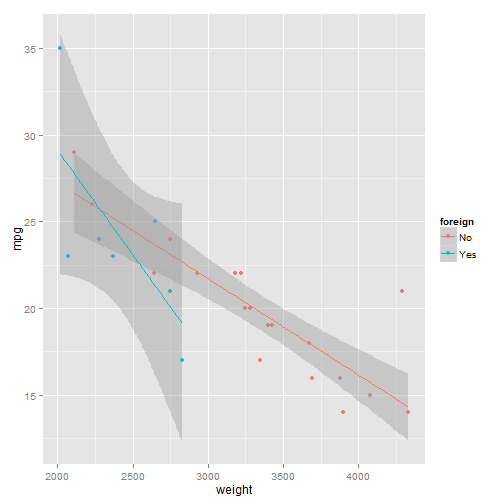

# knitting SAS

As long as SAS is not in your `PATH` variable, you need to specify its full path
with the `engine.path` chunk option.

Now, if you prefer to use SAS for data analysis, this shows it is 
possible to write the analysis in SAS, and then run:


```r
library(knitr)
knit("knittingSAS.Rmd")
```


`knitr` is powerful enough to allow for multiple input languages in one file.
Note that SAS was used in the first chunk, the following is the equivalent in R.

*Thank you* to Matt Mulvahill for running this example in Linux, (remove the engine.path from the chunk options if running under linux).

----------------------------------------------------

## Example: Regression

Here is an example of a simple regression in both SAS and R.  Yeah, that's right, *two* analysis languages, one markup language, *one* final output.  The data came from <a>http://www.ats.ucla.edu/stat/sas/modules/graph.htm</a>.


```sas
DATA auto ;
  INPUT make $  mpg rep78 weight foreign ;
CARDS;
AMC     22 3 2930 0
AMC     17 3 3350 0
AMC     22 . 2640 0
Audi    17 5 2830 1
Audi    23 3 2070 1
BMW     25 4 2650 1
Buick   20 3 3250 0
Buick   15 4 4080 0
Buick   18 3 3670 0
Buick   26 . 2230 0
Buick   20 3 3280 0
Buick   16 3 3880 0
Buick   19 3 3400 0
Cad.    14 3 4330 0
Cad.    14 2 3900 0
Cad.    21 3 4290 0
Chev.   29 3 2110 0
Chev.   16 4 3690 0
Chev.   22 3 3180 0
Chev.   22 2 3220 0
Chev.   24 2 2750 0
Chev.   19 3 3430 0
Datsun  23 4 2370 1
Datsun  35 5 2020 1
Datsun  24 4 2280 1
Datsun  21 4 2750 1
;
RUN; 

proc reg data = auto;
model mpg = weight foreign;
run;

```


 
                                                                                                
 
                                         The SAS System

                                       The REG Procedure
                                         Model: MODEL1
                                    Dependent Variable: mpg 

                            Number of Observations Read          26
                            Number of Observations Used          26

                                      Analysis of Variance
 
                                             Sum of           Mean
         Source                   DF        Squares         Square    F Value    Pr > F

         Model                     2      376.03207      188.01603      22.78    <.0001
         Error                    23      189.81409        8.25279                     
         Corrected Total          25      565.84615                                    

                      Root MSE              2.87277    R-Square     0.6645
                      Dependent Mean       20.92308    Adj R-Sq     0.6354
                      Coeff Var            13.73013                       

                                      Parameter Estimates
 
                                   Parameter       Standard
              Variable     DF       Estimate          Error    t Value    Pr > |t|

              Intercept     1       40.15037        3.52485      11.39      <.0001
              weight        1       -0.00608        0.00103      -5.88      <.0001
              foreign       1       -1.40659        1.58930      -0.89      0.3853


### in R


```r
dat <- 
"AMC     22 3 2930 0
AMC     17 3 3350 0
AMC     22 . 2640 0
Audi    17 5 2830 1
Audi    23 3 2070 1
BMW     25 4 2650 1
Buick   20 3 3250 0
Buick   15 4 4080 0
Buick   18 3 3670 0
Buick   26 . 2230 0
Buick   20 3 3280 0
Buick   16 3 3880 0
Buick   19 3 3400 0
Cad.    14 3 4330 0
Cad.    14 2 3900 0
Cad.    21 3 4290 0
Chev.   29 3 2110 0
Chev.   16 4 3690 0
Chev.   22 3 3180 0
Chev.   22 2 3220 0
Chev.   24 2 2750 0
Chev.   19 3 3430 0
Datsun  23 4 2370 1
Datsun  35 5 2020 1
Datsun  24 4 2280 1
Datsun  21 4 2750 1"

auto <- read.table(col.names = c("make", "mpg", "rep78", "weight", "foreign"),
                   text      = dat)
auto$foreign <- factor(auto$foreign, 0:1, c("No", "Yes"))
str(auto)
```

```
## 'data.frame':	26 obs. of  5 variables:
##  $ make   : Factor w/ 7 levels "AMC","Audi","BMW",..: 1 1 1 2 2 3 4 4 4 4 ...
##  $ mpg    : int  22 17 22 17 23 25 20 15 18 26 ...
##  $ rep78  : Factor w/ 5 levels ".","2","3","4",..: 3 3 1 5 3 4 3 4 3 1 ...
##  $ weight : int  2930 3350 2640 2830 2070 2650 3250 4080 3670 2230 ...
##  $ foreign: Factor w/ 2 levels "No","Yes": 1 1 1 2 2 2 1 1 1 1 ...
```

```r

fit <- lm(mpg ~ weight + foreign, data = auto)
summary(fit)
```

```
## 
## Call:
## lm(formula = mpg ~ weight + foreign, data = auto)
## 
## Residuals:
##    Min     1Q Median     3Q    Max 
## -4.533 -1.252 -0.361  0.477  8.541 
## 
## Coefficients:
##             Estimate Std. Error t value Pr(>|t|)    
## (Intercept) 40.15037    3.52485   11.39  6.2e-11 ***
## weight      -0.00608    0.00103   -5.88  5.4e-06 ***
## foreignYes  -1.40659    1.58930   -0.89     0.39    
## ---
## Signif. codes:  0 '***' 0.001 '**' 0.01 '*' 0.05 '.' 0.1 ' ' 1
## 
## Residual standard error: 2.87 on 23 degrees of freedom
## Multiple R-squared:  0.665,	Adjusted R-squared:  0.635 
## F-statistic: 22.8 on 2 and 23 DF,  p-value: 3.51e-06
```

```r

library(ggplot2)
```

```
## Warning: package 'ggplot2' was built under R version 3.0.2
```

```r
ggplot(auto) + aes(x = weight, y = mpg, color = foreign) + 
  geom_point() + geom_smooth(method = "lm")
```

 


```r
print(sessionInfo(), local = FALSE)
```

```
## R version 3.0.1 (2013-05-16)
## Platform: x86_64-w64-mingw32/x64 (64-bit)
## 
## attached base packages:
## [1] stats     graphics  grDevices utils     datasets  methods   base     
## 
## other attached packages:
## [1] ggplot2_0.9.3.1 knitr_1.5      
## 
## loaded via a namespace (and not attached):
##  [1] colorspace_1.2-4   dichromat_2.0-0    digest_0.6.3      
##  [4] evaluate_0.5.1     formatR_0.10       grid_3.0.1        
##  [7] gtable_0.1.2       labeling_0.2       MASS_7.3-26       
## [10] munsell_0.4.2      plyr_1.8           proto_0.3-10      
## [13] RColorBrewer_1.0-5 reshape2_1.2.2     scales_0.2.3      
## [16] stringr_0.6.2      tools_3.0.1
```


